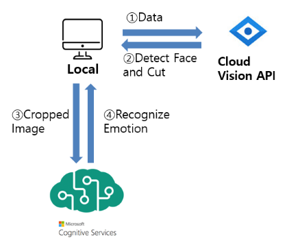

# 스마일프로젝트
### 한이음2018 입선 - 스마일 프로젝트  
### [시연동영상](https://youtu.be/LGShuBkwnIw)

###  목차
1. 작품 소개
2. 작품 구성도
3. 기능
4. 개선 해야 할 점

---

#### 1. 작품소개

ㅇ 기획의도
- 엔도르핀 분비 증가 등 웃음의 긍정적인 효과에 집중하여 우울증. 불안 장애와 같은 정신 질환을 비교적 많이 겪는 현대인들을 지금보다 더 많이 웃게 만들어 보다 나은 삶을 살아갈 수 있도록 돕고자 함. 또한 웃는 것에 대한 거부감을 줄이고 인상이 개선될 수 있도록 도움.

- 기존의 인공지능 모델이 동양 여성에게 있어 인식률이 떨어지는 디지털 편향성을 해결하기 위한 해결책을 제시하고자 함.

- 비전문가들도 인공지능 서비스를 친숙하고 흥미롭게 경험할 수 있도록 함.

#### 2. 구성도

1. 작품 구성도

2. 데이터 수집 시스템 구성도

3. 학습 시스템 구성도

 

#### 3. 기능
> 시연동영상 참조.
1) 웃어서 잠금 해제 : 웃는 경우에만 어플 잠금을 해제하는 기능

2) 스마일 챌린지 : 웃는 횟수 등으로 구성된 데일리 미션

3) 웃음 일기 : 잠금 해제 시 저장된 사용자의 웃는 사진들을 일기 형식으로 수치와 함께 보여줌

4) 알람 : 위치기반, 사용자가 원하는 시간, 랜덤 알람

#### 4. 개선해야 할 점
1) 사진 저장 시 회전 문제

2) 웃음 감정 분석 속도 개선
